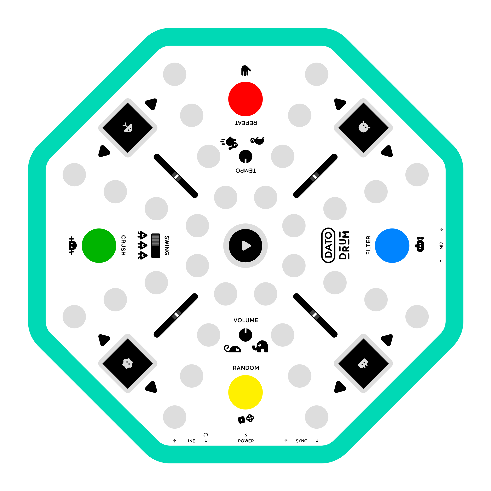

# DRUM Firmware Repository

This repository contains the firmware and related code for the DRUM project.

## What is Dato DRUM?

Dato DRUM is a circular drum machine with 4 drum voices, each with pressure-sensitive pads and 8-step sequencers. The octagonal design allows multiple users to access controls from different positions.

**Features:**
- 4 drum voices with individual sequencers and pitch controls
- Sample-based synthesis with user-replaceable samples
- Real-time effects and tempo/swing controls
- MIDI I/O and sync connections
- USB-C for power and sample management



## Hardware & Firmware Architecture

The device runs on an RP2350 microcontroller with dual-partition firmware (A/B) for safe updates. The codebase is written in C++20 using the Pico SDK with hardware abstraction layers. Audio processing operates in real-time with MIDI support over both DIN and USB connections.

## Directory Structure:
- `drum/`: Application C++ source code
- `musin/`: Core C++ library source code.
  - `drivers/`: Hardware device drivers (e.g., codecs, sensors).
  - `hal/`: Hardware Abstraction Layer for microcontroller peripherals (e.g., RP2040, RP2350).
  - `audio/`: Audio processing components.
  - `ui/`: User interface elements.
  - `usb/`: USB communication handling.
  - `ports/`: Platform-specific code and libraries (e.g., Pico SDK integration).
- `test/`: Unit and integration tests for `musin` and `drum` code.
- `tools/`: Utility scripts and tools for development/deployment.
- `lib/`: External libraries. 

## Building the Firmware

The main firmware for the DRUM project is located in the `drum/` directory. To build the firmware, navigate to the `drum/` directory.
Use `./build.sh` to build and upload firmware with A/B partition support:

```bash
./build.sh [OPTIONS]
```

**Common Options:**
- `-v, --verbose`: Enable verbose logging
- `-r, --ram`: Copy to RAM (default) 
- `-f, --flash`: Build for flash execution
- `-p N, --partition=N`: Upload to partition 0 (Firmware A) or 1 (Firmware B)
- `-c, --clean`: Remove build directory before building
- `-n, --no-upload`: Build only, don't upload
- `--setup-partitions`: Create and flash partition table from drum/partition_table.json
- `-h, --help`: Show all options

**Note:** The build script automatically attempts to force the device into BOOTSEL mode when needed.

**Examples:**
```bash
./build.sh                   # Default: RAM build, auto-upload
./build.sh -v -p 1           # Verbose, upload to Firmware B
./build.sh --clean --flash   # Clean flash build
```

## Running the Tests

```bash
cd test && ./run_all_tests.sh
```

### Sender Application Tests

The `test/sender` directory contains a Node.js/TypeScript test suite for verifying the device's MIDI communication protocols from a host computer.

To run these tests, first install the dependencies:

```bash
cd test/sender
npm install
```

Then, run the main test suite:

```bash
npm test
```

#### Optional and Destructive Tests

The test suite includes tests that are skipped by default because they are long-running, destructive, or require manual intervention. You can enable them using environment variables:

-   **Run long-running tests** (e.g., transferring large files):
    ```bash
    RUN_LARGE_TESTS=true npm test
    ```

-   **Run destructive tests** (e.g., formatting the filesystem). **Warning:** This will erase the device's storage.
    ```bash
    RUN_DESTRUCTIVE_TESTS=true npm test
    ```

-   **Run the reboot test**. This test verifies that the device can reboot into the bootloader and then automatically reboots it back to the main application using `picotool`.
    ```bash
    RUN_REBOOT_TESTS=true npm test
    ```
--- End of content ---
