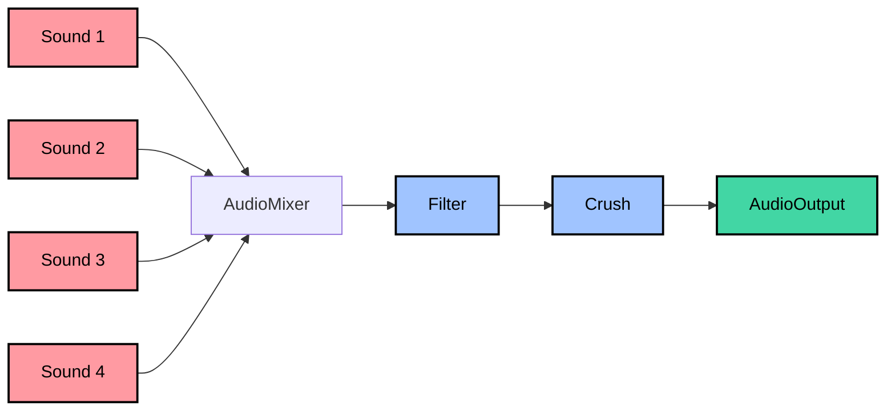

### AUDIO Signal Flow

### MIDI Implementation Chart

#### 1. Basic Information
- **Manufacturer ID**: 00 22 01 (DATO)
- **MIDI In**: Supported on USB and physical port
- **MIDI Out**: Not available
- **MIDI Thru**: Not available

---

#### 2. Channel Messages

| Function            | Transmitted | Recognized | 
|---------------------|-------------|------------|
| Note On             | No          | Yes        |
| Note Off            | No          | Yes        |
| Control Change      | No          | Yes        |
| Channel Pressure    | NO          | No         |
| Program Change      | No          | No         |
| Pitch Bend          | No          | No         |
| Poly Pressure       | No          | No         |

---

#### 3. Control Change Assignments (Received)

| CC#  | Parameter            | Range  | Remarks                           |
|------|----------------------|--------|-----------------------------------|
| 7    | Volume               | 0-127  | Scaled from 0-100%                |
| 75   | Low Pass Filter Freq | 0-127  | Scaled from 0-100%                |
| 76   | Low Pass Filter Res  | 0-127  | Scaled from 0-100%                |
| 77   | Bitcrusher Squish    | 0-127  | Scaled from 0-100%                |
| 78   | Bitcrusher Squeeze   | 0-127  | Scaled from 0-100%                |

